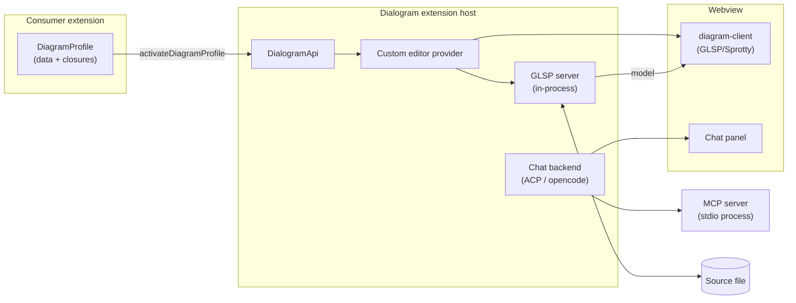

# Dialogram

**Talk to your diagrams.**

Dialogram is a general-purpose diagram platform for VS Code extensions, built
on [Eclipse GLSP](https://eclipse.dev/glsp/), with an integrated agent chat
driven by [opencode](https://opencode.ai) over the Agent Client Protocol
(ACP). A consumer extension contributes a **diagram profile** — its model
source, edit strategy, command ids, chat configuration — and gets the full
platform in return:

- a GLSP custom editor that opens a source file as an editable dataflow
  diagram (webview client, property panel, context menu, palette, grid,
  SVG export),
- automatic ELK layout with per-file layout persistence, undo/redo through
  reversible workspace edits,
- a chat panel whose agent can inspect and edit the *live* diagram through
  in-process MCP tools, with per-turn selection context,
- run integration: execution overlays streamed onto the diagram (live node
  glow, running-agents bar with SSE token streaming), run/stop commands,
  bounded event replay when a webview is closed and reopened mid-run,
- cross-file drill-down navigation and file watching.

The platform core is **strictly product-neutral**: no consumer vocabulary
appears in the core packages (enforced in CI, see
[Neutrality gates](#neutrality-gates)). Everything product-specific arrives
through the profile.

Multiple consumers can be installed simultaneously — every command id, view
type, and settings namespace is consumer-owned and disjoint by contract.

## Architecture

Dialogram ships as a VS Code extension (`ebezati.dialogram`). Its build
emits four bundles:

| Bundle | What it is |
| --- | --- |
| `out/main.cjs` | Extension host entry: `activate()` returns the `DialogramApi` |
| `dist/platform.cjs` | The platform runtime (GLSP server, editor provider, chat backend, sidecar toolkit) — loaded once and shared by every profile |
| `dist/sidecar-mcp-server.cjs` | Standalone MCP server process spawned for agent sessions over stdio |
| `dist/webview/diagram-client.*` | The stock GLSP/Sprotty webview client (browser IIFE + CSS with inlined fonts) |



The GLSP server runs **inside the extension host** (not a separate process).
Everything a profile registers is bound to the *consumer's*
`ExtensionContext`, so disposables die with the consumer extension. Webview
and MCP assets are served from Dialogram's own install directory.

### Packages

| Package | Role |
| --- | --- |
| `packages/shared` | Browser-safe types/constants shared by GLSP server and client: diagram types, DI binding keys, the seam interfaces (`DiagramModelSource`, `EditStrategy`, `DiagramEditBackend`, `ExecutionOverlaySink`, …) |
| `packages/diagram-server` | GLSP server: graph building, edit-operation handling, ELK layout, layout persistence, execution-overlay plumbing, load-time performance breadcrumbs |
| `packages/diagram-client` | GLSP/Sprotty webview client — ships the stock diagram **and** is consumable as a library (`createDiagramContainer`, `DiagramWebviewChannel`). See its [README](packages/diagram-client/README.md) for the full consumer contract |
| `packages/extension-core` | Profile-driven runtime: custom-editor activation, chat backend (ACP/opencode sessions, context injection, in-process MCP tools), run-event streaming. **`src/api.ts` is the public API contract** (future `@dialogram/api` package) |
| `packages/sidecar-toolkit` | Everything for *sidecar-backed* consumers: the CLI graph model source, the 16 edit-operation handlers, the run driver, Python navigation, and `createSidecarDiagramProfile` — the one-call profile assembler |
| `packages/extension` | The host extension shell: manifest, `activate()`, and the esbuild recipes for the four bundles |

Only `packages/extension` has a real build; the inner packages' `main` points
at `src/index.ts` and esbuild resolves `@dialogram/*` imports straight to
TypeScript sources.

## Consuming Dialogram

There are two ways in, ordered from simplest to most invasive.

### 1. Sidecar-backed diagrams (the wfpy / calpy path)

For a consumer whose source files are rewritten by an external **sidecar
CLI** (see [The sidecar contract](#the-sidecar-contract)). Declare Dialogram
in `extensionDependencies`, then hand the platform one flat literal of
product values — command ids, settings namespace, sidecar op prefix,
behavior flags — and let it assemble the profile **inside its own bundle**:

```ts
import * as vscode from 'vscode';
import {
    DIALOGRAM_EXTENSION_ID,
    isApiVersionCompatible,
    type DialogramApi,
    type SidecarDialogramApi
} from './dialogram-api'; // vendored @dialogram/extension-core/api + sidecar-toolkit types
import { MY_PROFILE_INPUT } from './profile'; // plain data, `satisfies SidecarProfileInput`

export async function activate(context: vscode.ExtensionContext) {
    const base = vscode.extensions.getExtension<DialogramApi & SidecarDialogramApi>(DIALOGRAM_EXTENSION_ID);
    const api = await base.activate();
    if (!isApiVersionCompatible(api.apiVersion)) {
        throw new Error(`Dialogram API ${api.apiVersion} is incompatible`);
    }
    const profile = api.createSidecarDiagramProfile(MY_PROFILE_INPUT);
    const handle = await api.activateDiagramProfile(context, profile);
    context.subscriptions.push(handle);
}
```

`createSidecarDiagramProfile` wires the toolkit's model source, server
modules, operation handlers, edit backend, run driver, navigation provider
and new-source-file command — everything DI-decorated stays inside the
platform bundle (see [The bundle-boundary law](#the-bundle-boundary-law)).

### 2. Build-time library (custom views and model source)

For a consumer with **fully custom views and its own model source**. Instead
of calling across the extension boundary, the consumer bundles
`@dialogram/extension-core` into its *own* extension bundle (esbuild alias
resolution to a Dialogram checkout) and calls `activateProfileRuntime`
directly. This unlocks the fields that may never cross the extension API:

- `serverDiagramModule` — a custom GLSP `DiagramModule` with the consumer's
  own server-side DI classes,
- `edits.operationModules` / `serverModules` — consumer-constructed inversify
  modules,
- a custom webview bundle composed with `createDiagramContainer` and served
  through `DiagramProfile.clientAssets` (data-only: paths, never code).

One realm rule governs this mode: **one esbuild bundle = one inversify/GLSP
realm.** The consumer's bundler must force a single instance of `inversify`
and the GLSP packages. The complete recipe (starter wiring, DOM anchors,
CSP, esbuild options, timing constraints) is in
[`packages/diagram-client/README.md`](packages/diagram-client/README.md).

## The `DiagramProfile` contract

`packages/extension-core/src/api.ts` is the single source of truth
(`DIALOGRAM_API_VERSION = '0.4.0'`). A profile carries, in outline:

| Group | Fields |
| --- | --- |
| Identity | `key`, `displayName`, `settingsNamespace`, `customEditorViewType`, `glspClientId`, `glspClientName` |
| Commands | `commands` (21 consumer-owned command ids), `operationKinds` (port create/delete kind strings) |
| Model & edits | `modelSource` factory, `edits` (`'read-only'` or a strategy with operation modules), `serverModules`, `serverDiagramModule` (library mode only), `storageOptions` |
| Client | `clientBehavior` (neutral capability flags injected into the webview), `clientAssets` (custom webview bundle — data only), `onWebviewMessage` (inbound message hook) |
| Features | `watch` (file globs), `navigation` (cross-file drill-down), `canOpenSource` (openability predicate), `editBackend` (chat mutation seam), `chat` (chat carry-overs), `runDriver` (factory receiving a `DiagramRunHost`), `newSourceFile` |

Everything optional degrades gracefully: no `chat` → no chat backend, no
`runDriver` → no run/stop commands or live glow, no `clientAssets` → the
stock webview bundle.

The returned `DiagramProfileHandle` exposes chat diagnostics plus two
webview channels: `dispatchToWebview(uri, action)` (host→client GLSP action
over the overlay bridge) and `postToWebview(uri, message)` (raw
`webview.postMessage` for consumer-owned protocols such as cursor sync).

### API versioning

Pre-1.0, **major.minor must match exactly** — a minor bump may break.
Consumers must call `isApiVersionCompatible(api.apiVersion)` at activation
and fail with an actionable message. `0.4.0` is the DiagramProfile v2
contract described here.

## The bundle-boundary law

The one rule that shapes the whole API, learned the hard way:

> **DI-decorated classes, inversify `ContainerModule`s, and `Symbol`-keyed
> bindings must never cross an esbuild bundle boundary. Only data, closures,
> and structurally-typed plain objects may.**

Each bundle carries its own inversify realm and Symbol table; a class
constructed in a consumer's bundle has no injection metadata in the
platform's realm and fails at resolution time (or worse, at GLSP's
DI-less `new ctor()` probes). Consequences baked into the API:

- Sidecar profiles are assembled **platform-side** by
  `createSidecarDiagramProfile`; the assembler stamps
  `Symbol.for('dialogram.platformAssembledProfile')` on the result so the
  platform can tell its own DI objects round-tripping through the consumer
  from foreign ones.
- `assertProfileCrossesPlatformApiSafely` rejects unbranded
  `serverModules` / `edits.operationModules` at the API boundary, and rejects
  `serverDiagramModule` unconditionally — that field is build-time-library
  only.
- `DiagramProfile.clientAssets` is path strings, never code objects.
- Library-mode consumers must force singleton resolution of inversify/GLSP
  in their bundler so their extension bundle is one realm.

## The sidecar contract

Sidecar-backed consumers never touch source text from the extension. Every
diagram edit becomes an operation sent to an external **sidecar CLI**
(e.g. `wfpy-sidecar`, `calpy-sidecar` — libcst-based) that rewrites the file
while preserving formatting. The wire protocol:

- newline-delimited JSON over stdin/stdout,
- requests `{ file, op: "<prefix>.<name>", args }`,
- responses carry a `revision` content hash; mutations pass
  `expectedRevision` for optimistic concurrency,
- capabilities discovered through `getCapabilities`,
- the source file is the single source of truth — no state-file overlays.

The toolkit's characterization suites run against fake sidecar/CLI fixtures
in `packages/sidecar-toolkit/test/fixtures/`, so the full protocol is
exercised without any product installed.

## Execution overlays and run drivers

A profile's `runDriver` factory receives a `DiagramRunHost`:

- `overlay: ExecutionOverlaySink` — push neutral execution events; the
  platform routes them to the webview as `dialogram.executionOverlay`
  actions (node glow, running-agents bar, SSE token streaming),
- `requestRefresh(sourceUri, kind)` — ask for a model rebuild without
  holding the GLSP connector,
- `useLiveOverlaySignatureSource(...)` — drive live-execution glow for runs
  started outside the IDE.

Overlay events are replayed (bounded, anchor-preserving) when a webview is
closed and reopened mid-run, so the bar and glow survive tab churn. The
toolkit ships `CliRunDriver` — a complete implementation over a spawned CLI
with SSE event streaming, per-entity agent-tool overrides, and process
control — which sidecar profiles get for free.

## Development

Requires Node 20 (volta-pinned). TypeScript strict, four-space indentation,
single quotes, all packages ESM (`"type": "module"`; host bundles emitted as
`.cjs`).

```bash
npm install
npm run build              # tsc -b + esbuild → out/, dist/
npm run watch              # incremental rebuild
npm test                   # vitest suites: diagram-server, diagram-client, extension-core, sidecar-toolkit
npm run check:neutrality   # the three product-neutrality gates (CI gate)
npm run package            # vsce package → dialogram-<version>.vsix at repo root
```

Single test file: from the package directory,
`npx vitest run test/<file>.test.ts`. Tests alias the `vscode` module to a
local mock and run in a node environment; the diagram-client suite also
proves the library consumer path by running the documented esbuild recipe
headlessly.

### Neutrality gates

`npm run check:neutrality` enforces that the platform stays product-free:

1. **Core content** — no `sidecar|wfpy|calpy|python` token anywhere in
   `diagram-server`, `diagram-client`, or `extension-core` sources (single
   sanctioned exception: `legacy-settings-compat.ts`, which names legacy
   settings keys).
2. **Toolkit content** — no `wfpy|calpy|calLang` token in `sidecar-toolkit`
   sources; the toolkit is sidecar-generic, products inject their strings.
3. **File names** — no product-derived file names in the core packages.

If a change trips a gate, the fix is to move the product value into the
consumer's profile input — never to extend the allow-list.

### Debugging aids

- `[dialogram build] <bundle> <ISO timestamp> <git sha>` — stamped into each
  bundle at build time; check the extension host console to confirm the
  running bundles are fresh.
- `[dialogram perf] load <file>#<n>: acquire=… layout=… loadTotal=…` —
  per-load phase attribution emitted by the diagram server, including which
  enrichment phases were deferred off the first paint. Loads after the first
  should be low-millisecond (memoized); expensive scans (caller references,
  skills/agents enrichment) run bounded in the background and redeliver via
  `refresh-*` model requests.

## Documentation

- [`packages/diagram-client/README.md`](packages/diagram-client/README.md)
  — the complete client-library consumer contract.

## Status

The DiagramProfile v2 program (fully neutral core, sidecar toolkit, client
library, first library-mode consumer) is complete at API `0.4.0`. Known open items: a
`DiagramProfile.diagramType` field, publishing the `@dialogram/api` npm
package and the Marketplace publisher, and passing `opencodePath` into the
ACP client explicitly instead of via the environment.
